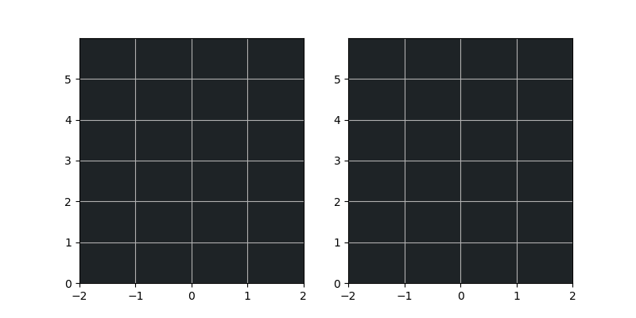
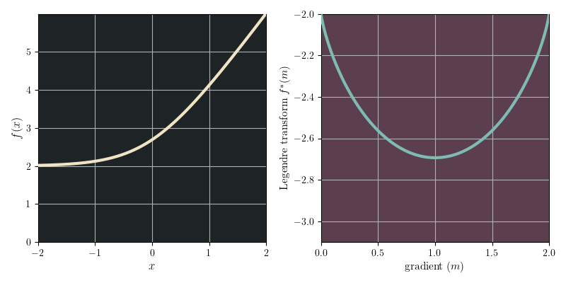
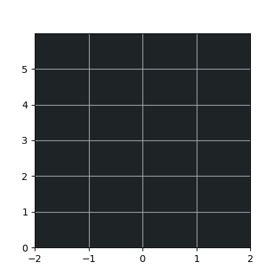
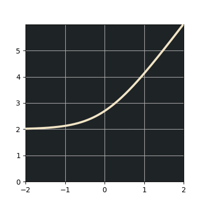
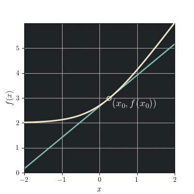
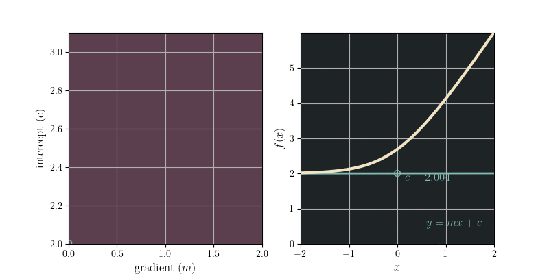
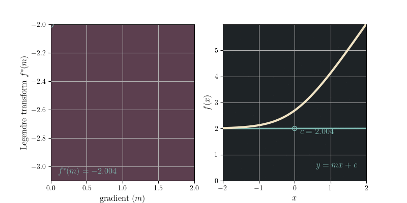
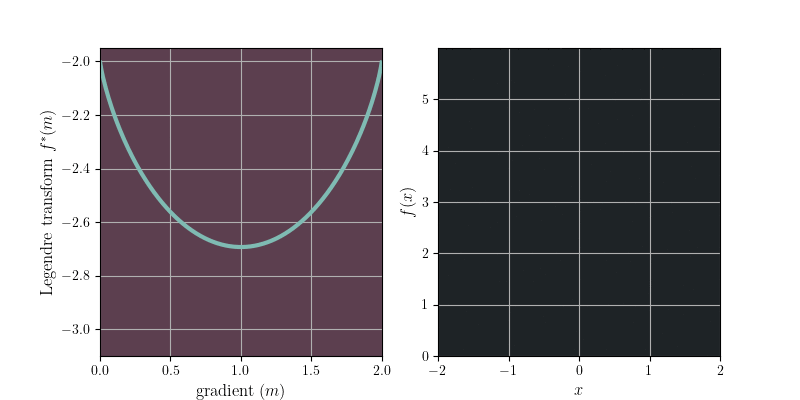

# Visualising the Legendre Transform

The [Legendre transform](https://en.wikipedia.org/wiki/Legendre_transformation) is incredibly useful in a wide range of areas including physics, economics, statistics and machine learning. However, its definition can be somewhat opaque. In this post, we look at how we might gain intuition for how the definition works by constructing it from scratch in a visual way.

We don't assume any previous familiarity with the Legendre transform. In fact, the Legendre transform will be motivated and derived over the course of this post. However, we do assume the reader has some basic familiarity with the idea of a [convex function](https://en.wikipedia.org/wiki/Convex_function). Our derivation will also focus more on building intuition than being 100% mathematically precise, though we will give references to more mathematically rigorous sources at the end of the post.

The key idea we will be building towards is this: A convex function defines a curve that can be described in two ways, one explicitly describing where each of the points in the curve lies, the other building the curve using a collection of straight lines.

By thinking about how to move from one of the description of the curve in terms of points to the one in terms of lines, we will see how the Legendre transform emerges. In doing so, we will build an understanding of the following image, where we go from the orignal convex function (left) to its Legendre transform (right):

Say we have a convex function $f$. We can draw a curve of that function on a pair of axes by setting $y=f(x)$, drawing each point $(x, f(x))$. By plotting finitely many points, we get an idea of the shape of the curve, if we draw every point we get a continuous curve. This is the usual way of describing the graph of a function.

But if $f$ is a convex function there is another way of describing the same curve, using the set of lines which never rise above the curve at any point.

We can write the equation for a line as $y=mx+c$, where $m$ is the gradient and $c$ is the intercept. Now, for any particular convex curve, some lines will intersect the curve and rise above it, while otherwise will not. To see this, let's choose a value for the gradient $m$ and try out different, increasing, values of $c$.

Notice that there is an upper limit on the value of $c$ such that the line doesn't cut through the curve.

For other values of $m$, there will be no value of $c$ where the line doesn't cut through the area above the curve.

So there are some values of $m$ for which there are lines with gradient $m$ in $\mathcal{L}$ but others where there aren't. In the former case, where we can find lines that don't rise above the curve, how do we find the largest allowed value of $c$? For largest allowable value of $c$, the line touches the curve.[^1]

Say that the line touches the curve when $x=x_0$. At this point, we have $f(x_0)=mx_0 + c$. Rearranging, we find the value of $c$ to be $c = f(x_0) - mx_0$. For all other values of $x$, the curve is on/above the line, and therefore $f(x) \geq mx+c$. We can see this in the following image by noting that vertical lines from $mx +c$ always reach *up* to $f(x)$, as opposed to reaching down.

Again, we can rearrange to get that in general $c \geq f(x) - mx$. But since equality is achieved when $x=x_0$, we have that $c$ is the smallest value that $f(x) - mx$ can take. We can therefore define $c$ by

$$c = \min_{x \in \mathbb{R}} f(x) - mx.$$

We can now plot a new curve: for each $m$, we plot this value of $c$:

Given a gradient $m$, we now have a way of determining the largest value of $c$ that doesn't give a line which rises above the curve (where such a $c$ exists). From the image above, we see that this mapping (from $m$ to the corresponding value of $c$) gives a line which is tangent to the original curve.

We are almost done, we just need to sort one detail. Notice that we started with a convex curve and ended up with a concave one. This isn't really a problem but to get to the Legendre transform, we need to make a small tweak: we plot $m$ against $-c$ rather than against $c$, turning the concave curve into a convex one. Looking at the definition of $c$ that we derived, we see that we can turn it into a definition of $-c$ in the form
$$-c = \max_{x \in \mathbb{R}} mx - f(x).$$

And this is how we define the Legendre transform: for a gradient $m$, the Legendre transform of the function $f$ tells us the largest value of $c$ such that $y=mx +c$ doesn't cut above the curve and flips its sign. Performing the Legendre transform on $f$ gives us the function $f^*$, which acts on a gradient $m$ according to the rule
$$f^\ast(m) = \max_{x \in \mathbb{R}} mx - f(x).$$

A minor technical detail is that the Legendre transform is usually defined using the supremum (the least upper bound of a set) rather than the maximum (the largest element). This definition helps deal with the cases we glossed over earlier where the line approaches the curve in the limit rather than touching it at a finite value.[^2] For the case we considered the maximum and supremum are equivalent, so we may write:

$$f^\ast(m) = \sup_{x \in \mathbb{R}} mx - f(x).$$
And with that, we have arrived at the definition of the Legendre Transform. We can visualise what the transform is doing like so:

We can now see how the Legendre transform can be used to construct the curve of a convex function from a set of straight lines.
On the left we have $y = f^*(m)$. On the right, we build $y=f(x)$ by taking values of $m$, then plotting $y=mx - f^\ast(m)$. With just a few lines we get a good approximation of the shape of the curve, with the approximation becoming exact if we draw the line for every $m$ gradient where there is a $y=mx+c$ in $\mathcal{L}$.

## Further Reading

Some resources if you are interested in learning more about the Legendre transform:
- [This paper](https://www2.ph.ed.ac.uk/~mevans/sp/LT070902.pdf), which gives a more formal treatment, with several example applications
- [This blog post](https://profoundphysics.com/legendre-transformations-for-dummies-intuition-and-examples/) for an alternative tutorial with an emphasis on application to physics

_If you have any comments or spot any errors in the above, please feel free to reach out to me on [Twitter](https://twitter.com/EchoStatements)_

[^1]: This isn't strictly true, the highest line to not cut into the area above the curve may just approach the curve in the limit. For clarity of exposition, we leave the handling of this case to footnotes.
[^2]: To see why this is needed, consider the case when $m=0$ for the example curve. We can see that the line $y=2$ lies below the curve and the two will meet in the limit. However, the never actually touch; furthermore for any value greater than 2, a horizontal line at that height will end up above the curve somewhere far to the left.

